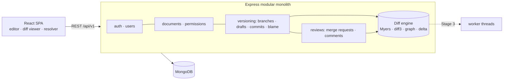

# VersaDoc — Git-style version control for documents

VersaDoc brings **branches, commits, diffs, three-way merging, merge requests with reviews, and blame** to everyday writing — project reports, research papers, SOPs and team docs — without anyone needing to learn Git.

Built with **MongoDB, Express, React and Node.js**. The version-control engine (Myers diff, three-way merge, commit graph, delta storage) is written from scratch.

## Project status

| Stage | Status |
|---|---|
| 1. Product | ✅ Complete — full feature set below |
| 2. Measure | 🔧 Benchmark script + k6 load test ready — results in progress ([docs/STAGE2_BENCHMARKS.md](docs/STAGE2_BENCHMARKS.md)) |
| 3. Optimize | 🔧 Content cache, worker-thread diffs and snapshot tuning implemented behind config flags ([docs/STAGE3_OPTIMIZATION.md](docs/STAGE3_OPTIMIZATION.md)) |

## Features

**Writing**
- Markdown editor (CodeMirror) with live preview and split view
- Drafts **autosave** while you type (your personal "working copy" per branch)
- Templates: project report, research paper, SOP, meeting notes

**Version control**
- **Commits** with messages, authors and +/− stats; history grouped by day
- **Branches** with ahead/behind counts against the default branch
- **Diffs** between any two versions — unified or split view, with **word-level highlights**
- **Restore** any old version (as a new commit — history is never rewritten)
- **Blame**: who last changed every line, and in which commit
- **Stale draft detection**: if a teammate commits while you're editing, your draft is updated with a three-way merge

**Collaboration & review**
- Roles per document: owner, editor, reviewer, viewer
- **Protected default branch**: editors propose changes through merge requests
- **Merge requests**: description, reviewers, **line comments**, threads, resolve, approve / request changes
- Required approvals — and **stale approvals** don't count after new commits
- Merge: fast-forward or a real **merge commit with two parents**
- **Conflict resolver**: pick current / incoming / both / write your own, or edit with Git-style markers
- Notifications, activity feed, dashboard ("waiting for your review")
- **Public documents** with a read-only published page

**Engineering**
- **Snapshot + delta storage** (like video keyframes) with SHA-256 integrity checks on every rebuilt version
- Optimistic concurrency on branch heads (no lost commits when two people commit at once)
- JWT access tokens + rotating refresh tokens (httpOnly cookie), role checks on every request, XSS-safe Markdown rendering, rate limiting
- Unit tests with randomized (property-based) checks for the algorithms + end-to-end API tests on a real in-memory MongoDB replica set

## Tech stack

| Layer | Tech |
|---|---|
| Frontend | React 19, Vite, Tailwind CSS v4, React Router, TanStack Query, Axios, CodeMirror 6, marked + DOMPurify, Recharts |
| Backend | Node.js 22, Express 5, Mongoose 8, Zod, JWT, bcrypt(js), Helmet, Pino, worker_threads |
| Database | MongoDB replica set (Atlas M0 works) |
| Testing | Vitest, Supertest, mongodb-memory-server, k6 |

## Architecture



Details: **[docs/ARCHITECTURE.md](docs/ARCHITECTURE.md)** · Interview prep: **[docs/INTERVIEW_GUIDE.md](docs/INTERVIEW_GUIDE.md)**

## Getting started

Requirements: Node.js 22, a MongoDB replica set (free Atlas M0 cluster).

```bash
npm install
cp server/.env.example server/.env    # set MONGODB_URI + JWT_ACCESS_SECRET
npm run seed                          # demo users, documents, branches, merge requests (one with a conflict)
npm run dev                           # API :5000 · web :5173
```

Demo accounts (password `Demo@1234`): `demo@versadoc.dev` (owner), `priya@versadoc.dev` (editor), `rahul@versadoc.dev` (reviewer), `meera@versadoc.dev` (viewer).

| Command | What it does |
|---|---|
| `npm run dev` | API + web with hot reload |
| `npm run seed` | Reset the database and load demo data |
| `npm test` | Unit + integration tests |
| `npm run bench` | Stage 2 algorithm benchmarks (no database needed) |
| `k6 run load-tests/k6/editing.js` | Stage 2 API load test |

## Project structure

```
server/src
  lib/diff/        myers.js (diff) · merge3.js (three-way merge) · graph.js (merge base) · delta.js · view.js · pool.js (worker threads)
  modules/         auth · users · documents · versioning · reviews · activity · public
  middleware/      auth · validation · rate limits · errors
client/src
  features/        editor · diff (viewer + conflict resolver) · history · branches · reviews · insights · documents · dashboard · public
  layouts/         app shell + document tabs
docs/              architecture · interview guide · stage 2 & 3 · deployment
```

## Deployment

See **[docs/DEPLOYMENT.md](docs/DEPLOYMENT.md)** (MongoDB Atlas + Render + Vercel).

## License

MIT
